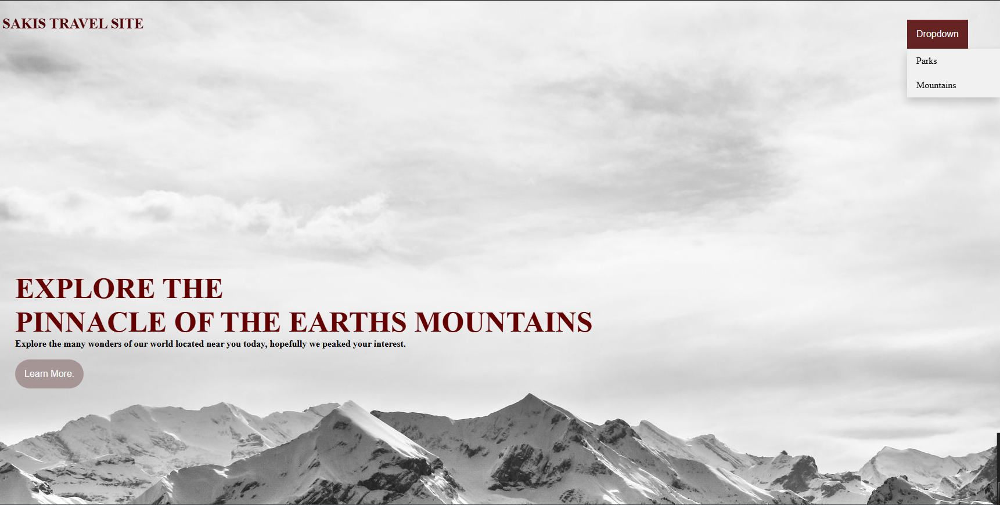
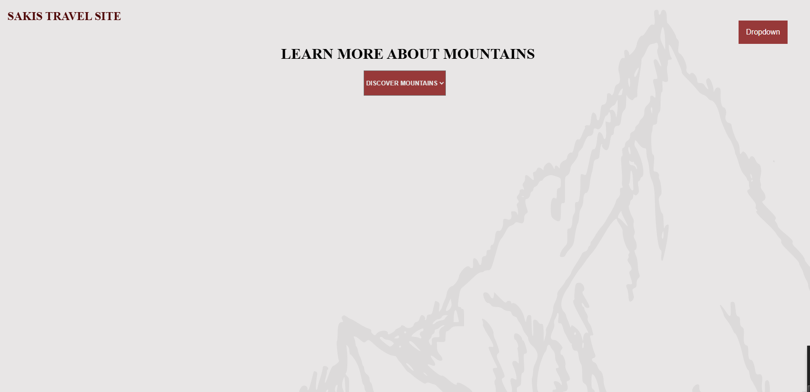
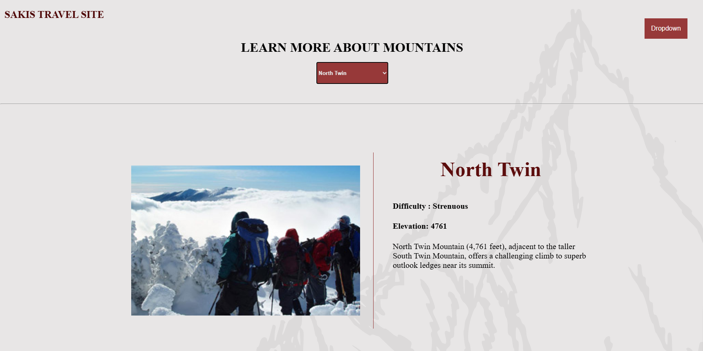
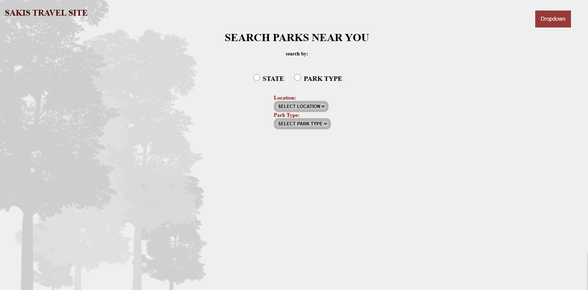
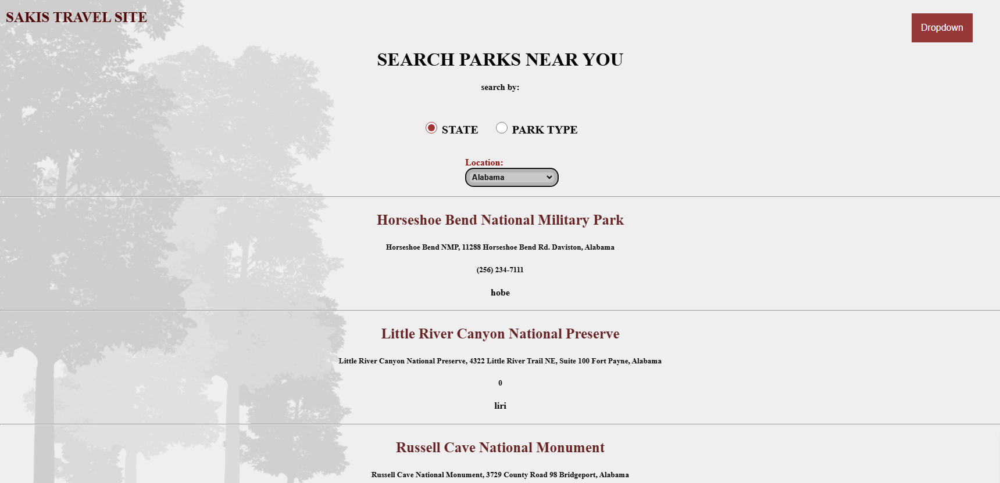
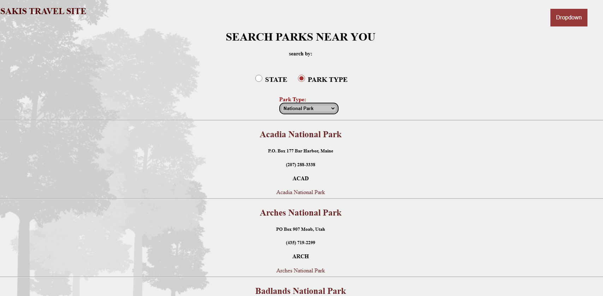

# enjoy_the_outdoors
Name: Assata Alayande
# HOMEPAGE
Added a hover function to drop down menu and learn more
which leads to Mountain page.

# MOUNTAINS PAGE

# PARKS PAGE
Made it so that when you click the radio button for either the select goes away.

I think im most satisfied with the displaying of the buttons and figuring out how to work with them, i also learned about z index while trying to display the background so I think that was pretty cool. I had fun designing this capstone.